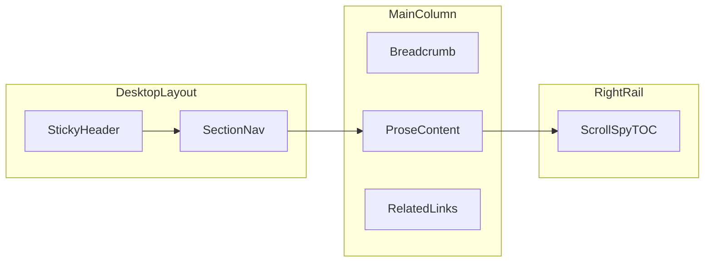

# Documentation system

Canonical spec for GUB in-app documentation. Markdown in `docs/` is the **source of truth** today; a future milestone renders it at `/games/<game>/docs/*` inside the Next.js app.

See also: [design-system.md](./design-system.md) (visual tokens), [source-organization.md](./source-organization.md) (code layout).

## Goals

| Audience | Need | Doc zone |
|----------|------|----------|
| Player at the table | Rules, scoring, quick lookup | `docs/games/<game>/rules/`, `reference/` |
| App user | How to use Play, Calculator, etc. | `docs/games/<game>/app/` |
| Contributor | Setup, conventions, adding games | `docs/contributing/` |

## Information architecture

```
docs/
├── README.md                 # Hub index
├── documentation-system.md   # This file
├── research/                 # Competitive analysis
├── shared/                   # Templates, glossary
├── games/<game>/             # Per-game content
└── contributing/             # Contributor guides
```

### Content rules

1. **One concept per file** — compose pages in-app later; avoid monolithic rulebooks.
2. **YAML frontmatter** on every page:

```yaml
---
title: Page title
description: One sentence for SEO / link previews
audience: player | user | contributor
game: skull-king          # omit for shared/contributing pages
section: rules | app | reference
order: 3                  # sort within section
artifacts: []             # optional: PirateAbilities, Kraken, Loot, …
source: src/lib/games/skull-king/round-score/score-rules.ts  # when tied to code
---
```

3. **Scoring and presets** must match code — cite `source:` in frontmatter; future CI (issue #24) will enforce.
4. **Artifact tags** — mark sections that only apply when an artifact is enabled (see [artifacts-matrix](./games/skull-king/reference/artifacts-matrix.md)).

## Layout (future in-app shell)

### Desktop (`lg+`)

Three-column reading layout — industry standard (Stripe, Next.js docs, Mintlify):

| Zone | Width | Content |
|------|-------|---------|
| Left sidebar | ~240px fixed | Game + section nav, collapsible groups |
| Main column | `max-w-prose` (~65–80ch) | Breadcrumb, H1, prose body, related links |
| Right rail | ~200px | Scroll-spy “On this page” TOC |

### Mobile

- Sticky header with menu icon → full-width drawer for section nav
- “On this page” collapses below H1 or behind a chip
- No horizontal scroll; tap targets ≥ 32px



## Typography

Align with [design-system.md](./design-system.md):

| Element | Spec | GUB utility |
|---------|------|-------------|
| Body | 16px (1rem), line-height 1.6–1.7 | `font-sans` (Manrope) |
| H1 | 30–36px, Epilogue semibold | `font-headline text-3xl` |
| H2 | 22–26px | `font-headline text-2xl` |
| H3 | 18–20px | `font-headline text-xl` |
| Code | 13–14px monospace | system mono stack |
| Nav items | 14px | `text-sm` |

Install `@tailwindcss/typography` before UI work (issue #18). Wrap body in `prose prose-invert max-w-none` inside `DocsProse`.

## Motion

Match [`src/styles/ui-motion.css`](../src/styles/ui-motion.css):

| Interaction | Duration | Easing |
|-------------|----------|--------|
| Mobile nav drawer open | 300ms | `cubic-bezier(0.4, 0, 0.2, 1)` |
| Mobile nav drawer close | 250ms | same |
| Drawer backdrop | 200ms fade | `ease` |
| Sidebar section expand | 180ms | `ease-in-out` |
| Search overlay | 200ms | `ease-out` |

**Accessibility:** wrap animations in `@media (prefers-reduced-motion: no-preference)`. When reduced motion is requested, skip slide/scale; use instant show/hide.

## Search (future)

- Cmd+K / Ctrl+K command palette
- Fuzzy index over titles, headings, glossary terms
- Lazy-load search index; keep docs shell &lt; 200KB JS gzipped

## Artifact filter (future)

GamersPaper-style: user toggles artifacts (Kraken, Loot, Pirate Abilities, …) matching [`artifacts.ts`](../src/lib/games/skull-king/artifacts.ts). Pages/sections with `artifacts:` frontmatter hide when none match.

## Shared components (future — do not build in doc-only phase)

| Component | Path | Role |
|-----------|------|------|
| `DocsLayout` | `src/components/docs/docs-layout.tsx` | 3-column shell + mobile drawer |
| `DocsNav` | `src/components/docs/docs-nav.tsx` | Left section navigation |
| `DocsTOC` | `src/components/docs/docs-toc.tsx` | Right-rail scroll-spy |
| `DocsProse` | `src/components/docs/docs-prose.tsx` | Typography wrapper |
| `DocsSearch` | `src/components/docs/docs-search.tsx` | Cmd+K palette |
| `ArtifactFilter` | `src/components/docs/artifact-filter.tsx` | Conditional section visibility |

Game wrappers stay thin: `src/components/games/skull-king/docs/` imports shared shell + nav config only.

### In-app route mapping (future)

| Route | Markdown source |
|-------|-----------------|
| `/games/skull-king/docs` | `rules/*` composed |
| `/games/skull-king/docs/play` | `app/play.md` |
| `/games/skull-king/docs/calculator` | `app/calculator.md` |
| `/games/skull-king/docs/reference/scoring` | `reference/scoring-quick-ref.md` |

## Quality checklist

Before merging doc PRs:

- [ ] Can a new player find setup + scoring in under 30 seconds on mobile?
- [ ] Does every scoring claim match `score-rules.ts`?
- [ ] Are artifact-specific rules tagged in frontmatter?
- [ ] Do Play/Calculator guides explain *when* to use each mode?
- [ ] Prose line length ~65–80ch when rendered?
- [ ] WCAG AA contrast on gold/cream/charcoal palette?
- [ ] `prefers-reduced-motion` respected in motion spec?
- [ ] Every page has `description` frontmatter?

## GitHub project management

- **Milestones:** M1 Foundation → M2 Skull King Content → M3 Contributor → M4 Docs Platform (app)
- **Labels:** `docs`, `skull-king`, `research`, `platform`, `good-first-issue`
- **Project board:** run `gh auth refresh -s project,read:project` then `gh project create --owner alirezaopmc --title "GUB Documentation"`

Issues #1–#24 track the full roadmap on [github.com/alirezaopmc/gub/issues](https://github.com/alirezaopmc/gub/issues).
