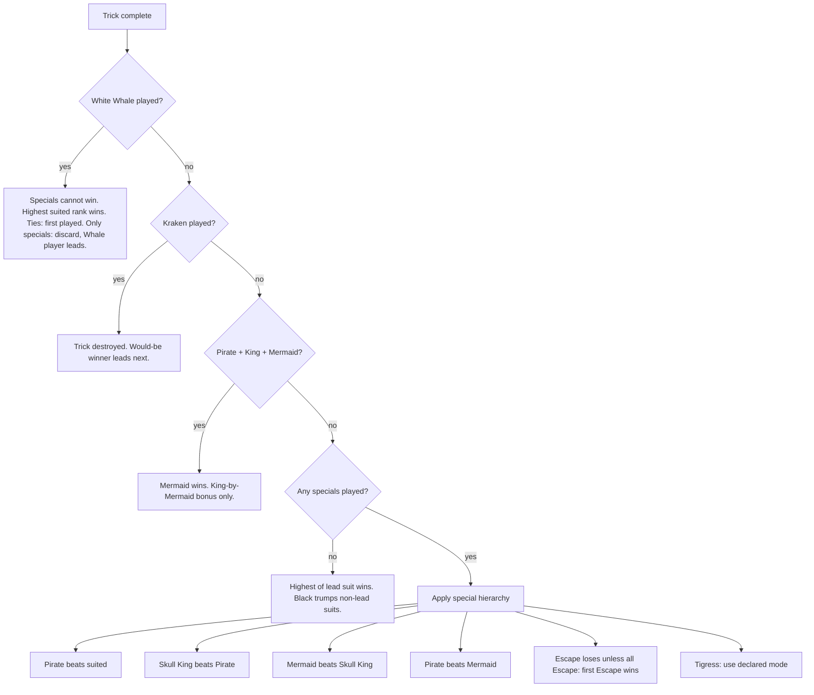

# Trick resolution

Use this at the table when multiple card types compete. For prose rules see [Card ranks](../rules/04-card-ranks.md).

## Decision flow



## Special beat order (no Whale)

```
Suited < Pirate < Skull King < Mermaid
         ↑___________________|
              Pirate beats Mermaid
```

Same special type → **first played** wins.

## Suited-only tricks

1. If all cards share the lead suit → highest rank of that suit wins.
2. If black played off-suit → black wins (highest black if multiple).
3. Off-suit non-trump cards do not beat in-suit cards.

## Kraken + Whale interaction

| Order played | Result |
|--------------|--------|
| Kraken first, Whale second | Whale rules |
| Whale first, Kraken second | Kraken rules |

## Loot alliance

When Loot is played and another player wins the suited portion, record **lootPlayerIndex** + **trickWinnerIndex** for scoring. See [Scoring](../rules/06-scoring.md).

## Related

- [Leading specials](../rules/05-leading-specials.md)
- [Advanced cards](../rules/07-advanced-cards.md)
- [FAQ](../rules/10-faq.md)
