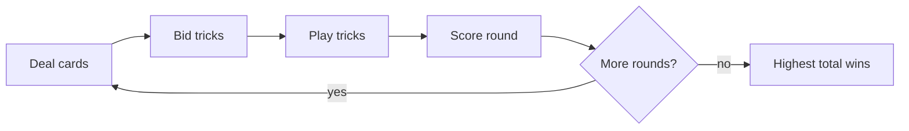

# Overview

## Objective

Skull King is a trick-taking card game played over multiple **rounds**. Each round:

1. Players receive a hand of cards.
2. Everyone **bids** how many tricks they will win.
3. Players play cards in **tricks** clockwise.
4. **Score** the round based on bid accuracy and bonuses.

The player with the **highest total score** after the final round wins. **Ties** are a shared victory (no tiebreaker round).

## How a round works

## What makes Skull King different

- **Trump suit** — black Jolly Roger beats other suits.
- **Character cards** — Pirates, Skull King, and Mermaids interact in a rock-paper-scissors hierarchy.
- **Optional advanced cards** — Kraken, White Whale, and Loot (see [Advanced cards](./07-advanced-cards.md)).
- **Optional pirate abilities** — each Pirate has a unique power when you win a trick with it ([Pirate abilities](./08-pirate-abilities.md)).

## In GUB

| Mode | Best for |
|------|----------|
| [Play](../app/play.md) | 3–8 players, each on their own device, live match |
| [Calculator](../app/calculator.md) | One device at the table, manual bid/trick entry |
| [Rules](./00-overview.md) | Learning or mid-game lookup |

## Related

- [Setup & deck](./01-setup-deck.md)
- [Scoring](./06-scoring.md)
- [Glossary](../../shared/glossary.md)
