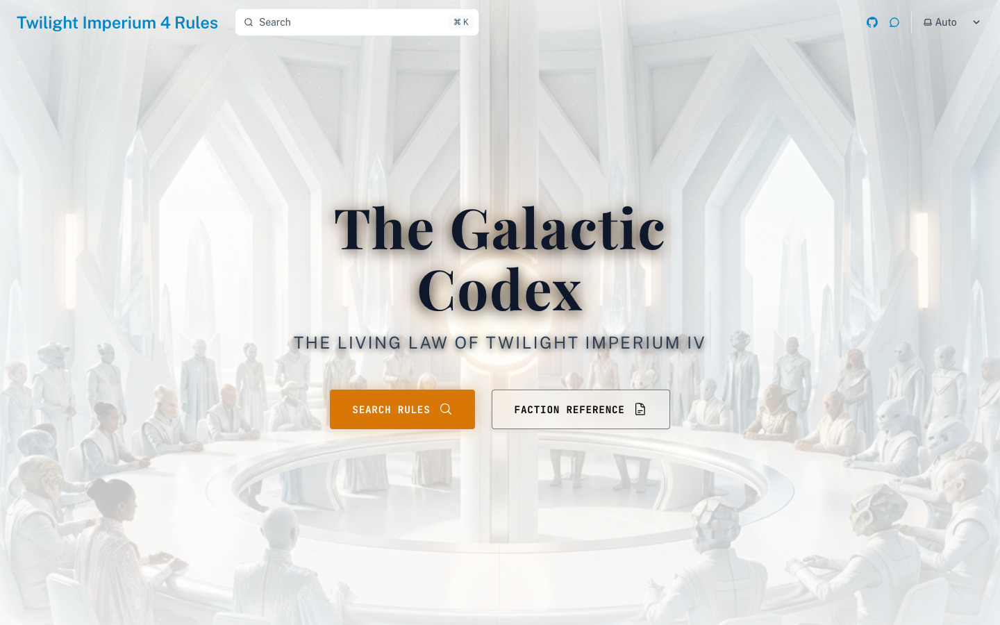
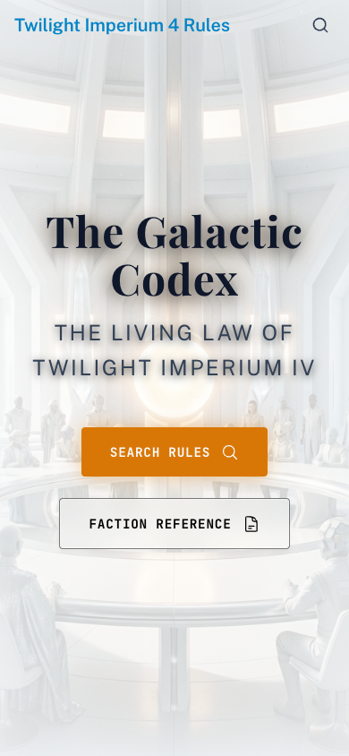
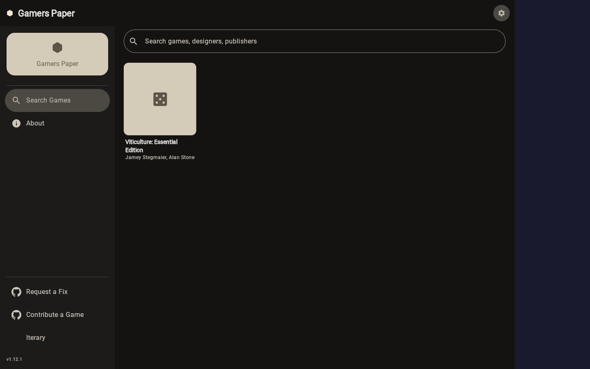
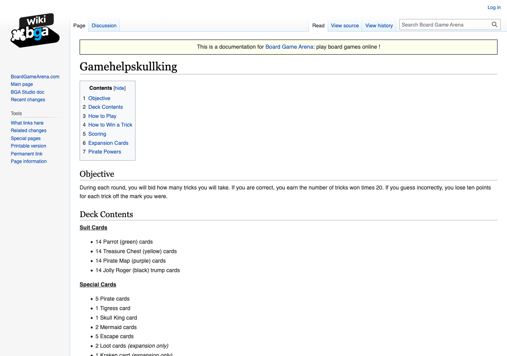
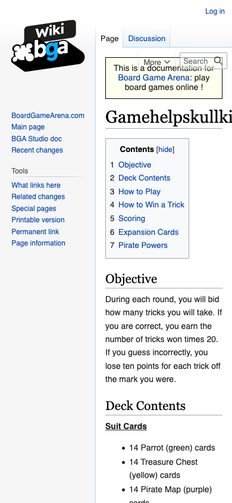
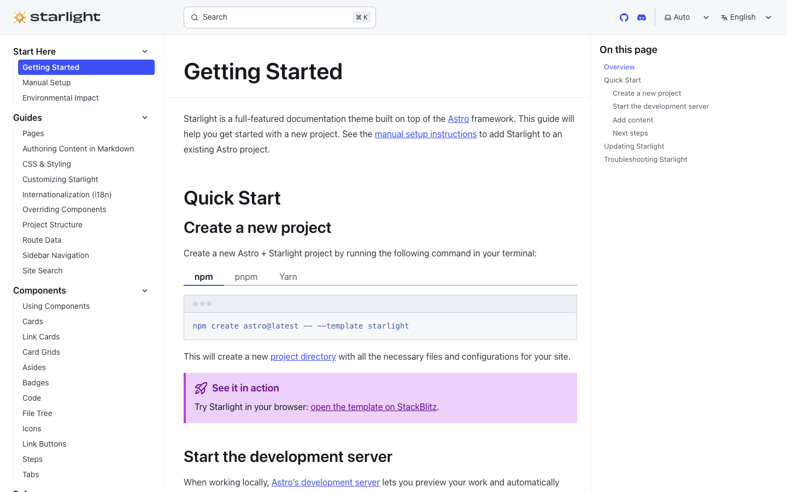

# Competitive analysis

Reference sites studied for GUB documentation design. Screenshots live in [`references/`](./references/).

## Summary matrix

| Site | Primary job | Standout methods | GUB adoption |
|------|-------------|------------------|--------------|
| [TI4 Rules](https://www.yjmrobert.com/tirules/) | Searchable rule reference | Markdown source, Cmd+K search, sidebar + TOC, dark/light | Content model + search (M4) |
| [GamersPaper](https://gamerspaper.com/) | Table-side companion | Player-count filters, section tabs, offline SPA | Artifact filter + intent nav (M4) |
| [BGA Skull King](https://en.doc.boardgamearena.com/Gamehelpskullking) | Official-adjacent rules | Objective-first, worked examples, expansion split | Scoring examples + FAQ structure |
| [Starlight](https://starlight.astro.build/getting-started/) | Docs theme reference | 3-column layout, hierarchical sidebar | Layout spec in documentation-system.md |

## TI4 Rules (tirules)

*Desktop: hero search, sidebar navigation, dark theme — “find a rule in seconds.”*

*Mobile: collapsible nav, search prominent.*

| Method | Why it works |
|--------|----------------|
| Markdown-as-source | Editors change rules without touching layout |
| Full-text search | Mid-game edge-case lookup |
| Sidebar + in-page anchors | Predictable three-zone layout |
| Theme toggle | Table lighting varies |
| Deep-linked sub-pages | Faction/card references |

**GUB takeaway:** adopt structured markdown + search + TOC even though delivery stays in-app.

## GamersPaper

*Game library grid with player count and duration in each card.*

*Mobile-first loading state; PWA-style companion.*

| Method | Why it works |
|--------|----------------|
| Player-count / expansion filters | Only show applicable rules |
| Tabs: Setup, Gameplay, Cards, Scoring | Intent-based, not rulebook order |
| Offline-capable | Bad Wi‑Fi at game nights |
| Open data repo | Community fixes without UI deploy |

**GUB takeaway:** filter by **artifacts** (Kraken, Loot, Pirate Abilities) matching `artifacts.ts`.

## BGA Skull King help

*Objective block first, deck contents as lists, expansion section separated.*

*Long-form prose; mobile relies on heading hierarchy.*

| Method | Why it works |
|--------|----------------|
| Objective-first | “What am I trying to do?” in two sentences |
| Worked scoring examples | Calvin bids 3, takes 3 → 60 pts |
| Expansion clearly separated | Base vs advanced cards |
| Pirate powers own section | Highest lookup cost |

**GUB takeaway:** expand with examples, trick-resolution tree, Play/Calculator guides.

## Starlight (layout reference)

*Canonical docs chrome: left nav, centered prose, right “On this page” TOC.*

| Method | Why it works |
|--------|----------------|
| Fixed header + stable columns | Low CLS while reading |
| Hierarchical sidebar | Scales to many pages |
| Right-rail TOC | Scroll-spy for long pages |

**GUB takeaway:** spec documented in [documentation-system.md](../documentation-system.md); implement in M4.

## Cross-cutting UX standards (2025–2026)

From industry docs patterns (Stripe, Next.js docs, Mintlify, WCAG):

- **Line length:** 65–80 characters for prose
- **Motion:** 180–200ms UI transitions; honor `prefers-reduced-motion`
- **Contrast:** WCAG AA on dark charcoal + gold/cream palette
- **Performance:** docs shell &lt; 200KB JS gzipped; lazy search index
- **Mobile:** drawer nav, ≥ 32px tap targets, no blocking popups

## References

- [TI4 Rules (tirules)](https://www.yjmrobert.com/tirules/)
- [GamersPaper](https://gamerspaper.com/)
- [BGA Skull King help](https://en.doc.boardgamearena.com/Gamehelpskullking)
- [Starlight](https://starlight.astro.build/)
- [BGA Studio UX guidelines](https://en.doc.boardgamearena.com/BGA_Studio_Guidelines)
